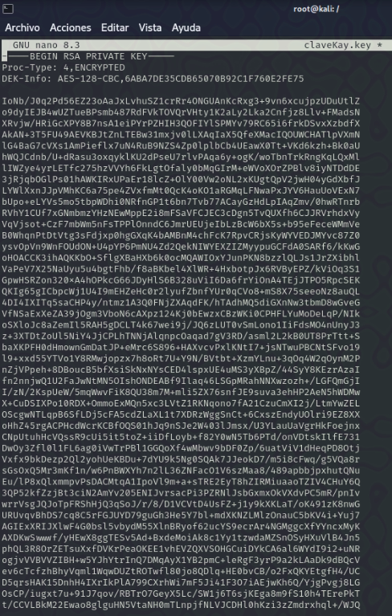

## Escaneo de puertos

```bash
nmap -sV -O ip
```

-sV: Para saber la version de los servicios que estan ejecutandose
-O: Para saber el SO


Hemos visto que tiene una pagina web en el puerto 80


Entonces hemos usado `dirbuster`para ver si tiene algun directorio oculto y hemos encontrado que en `/develompent` tiene dos directorios con dos mensajes uno es dev.txt que tiene esto:


Y el otro directorio que hemos encontrado es `j.txt` que contiene lo siguiente:


## SMBCLIENT

Ahora mediante smb nos intentamos conectar haciendo una conexión anonima:

```bash
smbclient -L //ip -N
```

-L: para que liste los recursos

-N: para conectarme anonimamente


Entramos en `IPC$` y no encontramos nada


Ahora entramos en Anonymous y encontramos un archivo que se llama `staff.txt` entonces lo que hacemos en traernos ese archivo con el comando `get`


Y dentro tenía esto:


Y vemos que hay dos nombres de usuario uno que es `Jan` y otro que es `Kay` ahora le haremos fuerza bruta con Hydra para saber la contraseña

## HYDRA

```bash
hydra -t 4 -l jan -P /usr/share/wordlists/rockyou.txt ssh://10.10.157.186
```

-t: Para la cantidad de hilos que usa
-l: para elegir un usuario en concreto
-P: para seleccionar un diccionario de contraseña


Nos ha dado que la contraseña es `armando`

## SSH

Ahora como tenemos nombre de usuario y contraseña nos conectamos por ssh con el siguiente comando

```bash
ssh jan@10.10.157.186
```

Entramos y buscamos si tiene el usuario kay en el `/home` vemos que lo tiene y que tiene un archivo que se llama pass.bak pero no tenemos acceso entonces miramos si hay archivos ocultos con `ls -la` y vemos que tiene esto:


vemos que hay varios directorios que pueden ser interesante como son el `.ssh` y el `.sudo_as_admin_sucessful` pero en este ultimo intentamos entrar y no podemos entonces intentamos en el `.ssh` y vemos que dentro tienen un archivo interesante que es el `id_rsa`


Le hacemos `cat` al `id_rsa` y nos da una clave encriptada:


Copiamos la contraseña y nos la llevamos a nuestra máquina y creamos un archivo que se llame `claveKay.key` y pegamos la clave:

```bash
nano claveKay.key
```



## JOHN THE RIPPER

Ahora ejecutamos el siguiente comando para extraer el hash

```bash
ssh2john claveKay.key > hashKay.txt
```


Y ahora le hacemos fuerza bruta ocn john the ripper para ver si podemos conseguir el hash de la contraseña.


Ahora que tenemos la contraseña `beeswax` nos conectamos a ssh de kay.


Una vez tenemos acceso a la maquina de kay hacemos `ls` para ver que tiene y vemos que tiene el archivo `pass.bak` y ahora le hacemos `cat` al archivo y ahora si tenemos permiso y ya obtenemos la contraseña que sería `heresareallystrongpasswordthatfollowsthepasswordpolicy$$`


