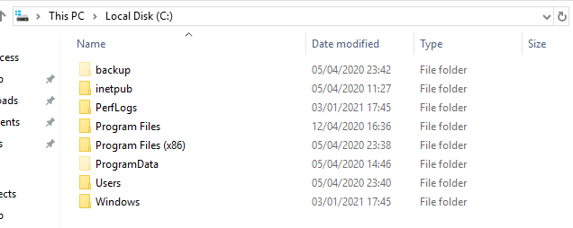

# ANTHEM

## Escaneos de puertos

```bash
nmap -Pn 10.10.11.8
```

-Pn: se salta el ping inicial


Vemos que tiene un servicio http en el puerto 80 es decir que es una pagina web asi que abrimos el navegador y encontramos esto


## Dirbuster

Para ver si tiene algún directorio oculto utilizamos Dirbuster


Hemos encontrado el directorio `/robots.txt` y en el hemos encontrado una posible contraseña que es `UmbracoIsTheBest!` y varios directorios de `umbraco` que es el CMS


## WGET

Para conseguir las flags dicen que están todas escondidas en la página entonces lo que hemos hecho ha sido un `wget` recursivo para obtener todos los datos de la página y lo que hemos hecho es que con el grep hemos filtrado por el principio de la flag que es `THM` y hemos encontrado esto


## RDESKTOP

Para el rdektop nos hemos conectado con la ip y el usuario sería SG de `Solomon Grundy` que es el administrador y la contraseña la que hemos encontrado en el robots.txt que es `UmbracoIsTheBest!`


En el escritorio nos encontramos un user.txt entramos y vemos la primera flag
`THM{N00T_NO0T}`


Para la siguiente flag nos dice que el directorio está oculto entonces lo que hacemos es abrir el explorador de archivos y activamos la opción de archivos ocultos. Miramos por los diferentes directorios y encontramos que en el Disco Local hay dos carpetas ocultas una que se llama `backup` y otra que se llama `ProgramData`, entramos en la primera carpeta que es backup y miramos que tiene



Esta carpeta `backup` tiene un archivo que se llama `restore.txt` pero cuando lo voy a abrir me dice que no tengo permisos y que mire quien es el dueño del archivo, asu que miramos las propiedades del archivo para buscar quien es el que tiene permisos.


Cuando miramos los permisos vemos que SG que es el usuario no tiene permisos para abrirlo pero si para modificar los permisos entonces nos hemos añadido para tener permisos para abrir el archivo.


Una vez hecho los cambios hemos abierto el archivo y encontramos la siguiente flag


## Escalar privilegios

Esta contraseña que hemos conseguido anteriormente es la contraseña del root así que ahora nos abrimos una terminal como root y buscamos la ultima flag


Ahora buscamos la flag por el sistema y buscando hemos encontrado que la flag está en el Escritorio del admin.


