# BLASTER

## Escaneos de puertos

```bash
nmap -Pn ip
```


-Pn: lo que hace es que asume que el host está activo y omite el ping inicial

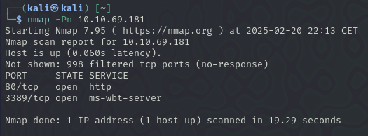


Esto nos da que hay una web y entramos y nos encontramos lo siguiente

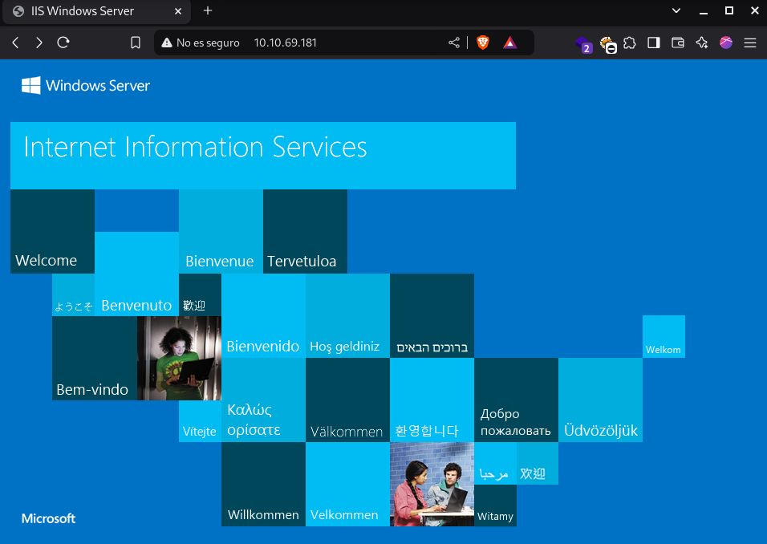

Fuzzeamos con dirbuster y encontramos un directorio escondido que se llama retro

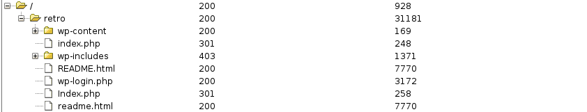

Tambien encontramos un index.php que nos lleva a esto

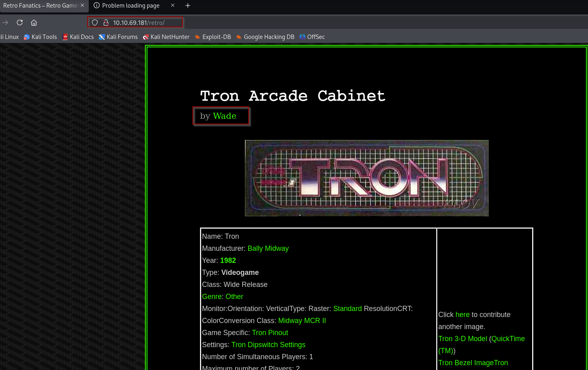

Y donde creemos que el usuarios es `Wade` ya que está puesto por todos los lados de la pagina

Para la contraseña nos hemos metido en los comentarios recientes de las publicaciones y hemos encontrado que es `parzival`

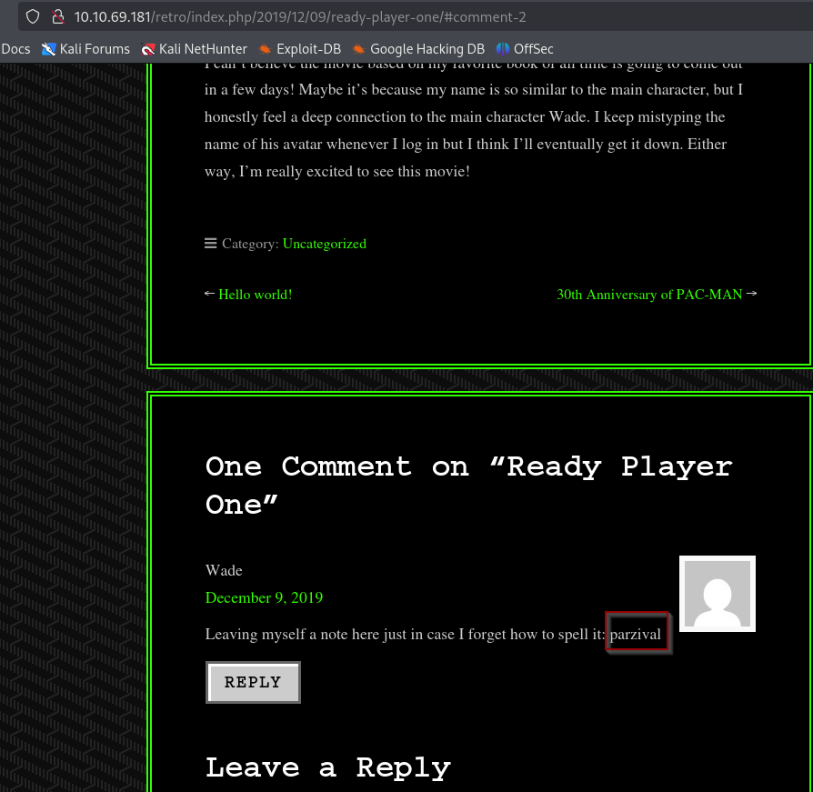

Y ahora nos conectamos mediante Remmina al ordenador del usuario ya que sabemos sus credenciales y la ip entonces probamos las credenciales y entramos y nos encontramos que en el escritorio hay un archivo que se llama `user.txt` y en ese archivo está la flag.

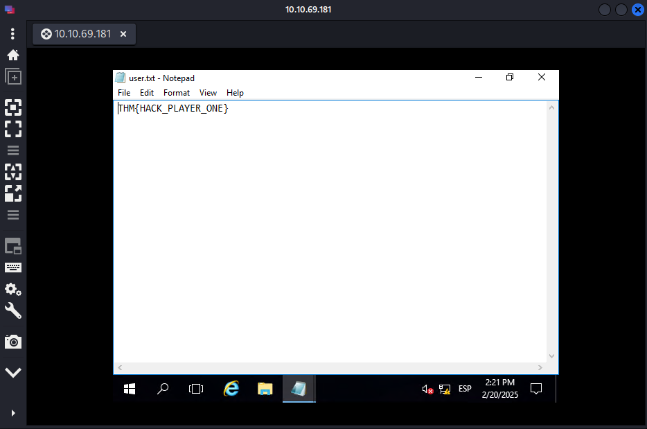

También en el escritorio hay una aplicación que explota una vulnerabilidad

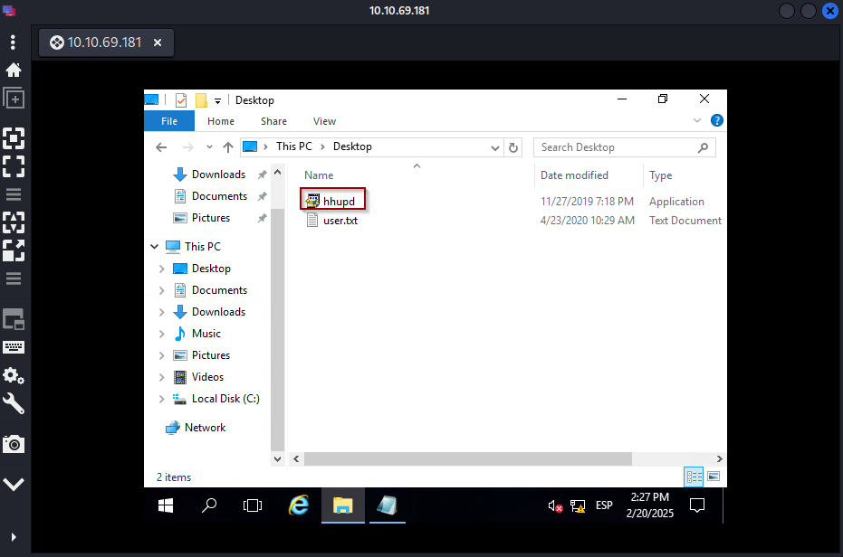

## Escala de privilegios

Abrimos el archivo hhupd

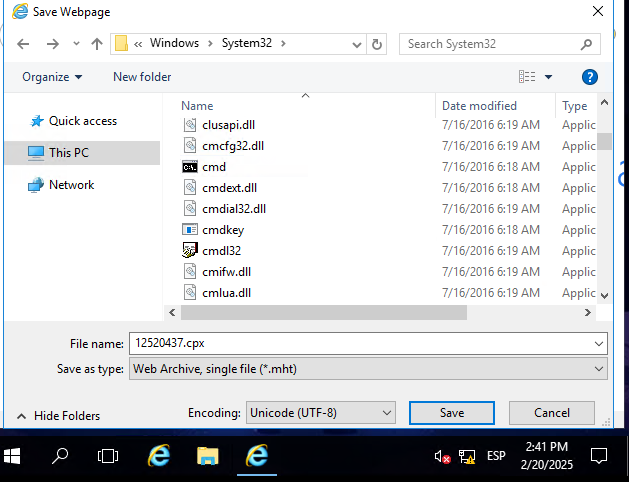

Abrimos el navegador y le damos a configuración File > Save as y seguimos con la imagen de abajo.

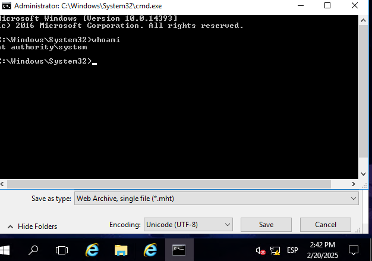

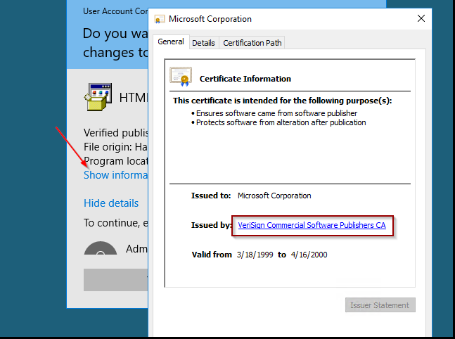


Vamos al escritorio y encontramos un archivo que se llama `root.txt` y encontramos el siguiente contenido `THM{COIN_OPERATED_EXPLOTATION}`

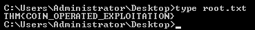

Para la persistencia del usuario  en metasploit utilizamos el siguiente comando `run persistence -X`