# ICE
## Escaneo de puertos

```bash
nmap -sV -O ip
```

-sV: para ver la version de los servicios
-O: para ver el SO

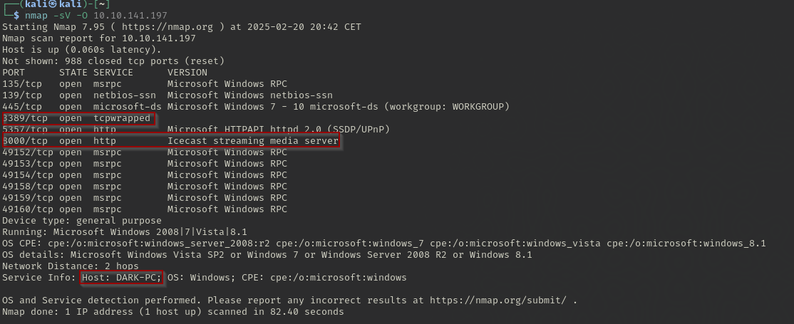

Ahora para ver la peligrosidad de la vulnerabilidad nos vamos a https://www.cvedetails.com/ y buscamos la vulnerabilidad de Icecast y vemos que nos pide una que tiene nota de 7.5 y nos pide el Impact Score entonces buscamos todas las de 7.5 de Base Score y hemos encontrado esta

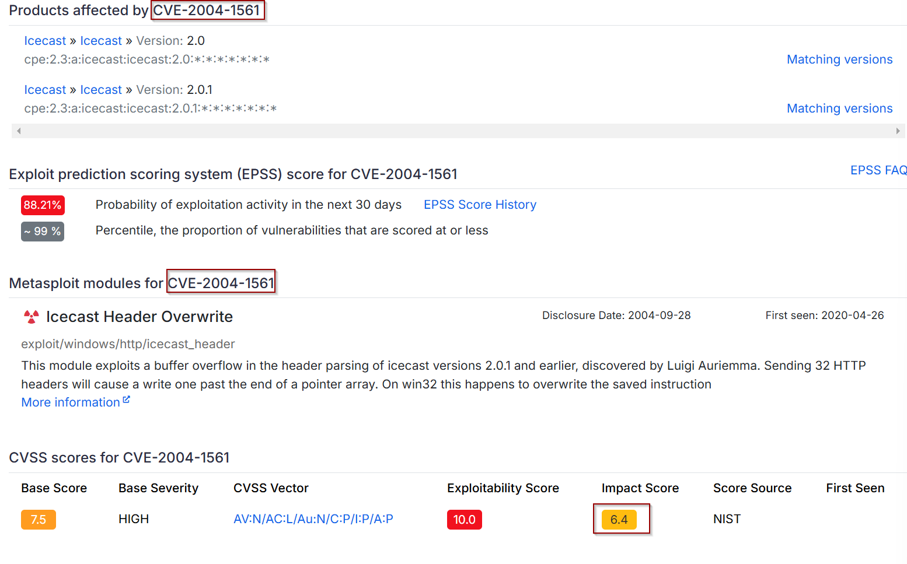

## Metasploit

Ahora entramos en metasploit y buscamos vulnerabilidades de icecast y nos aparece esto:


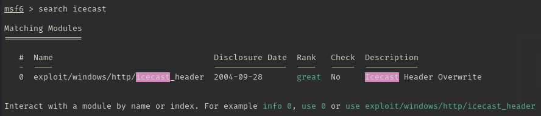

Usamos el único que nos aparece y lo configuramos

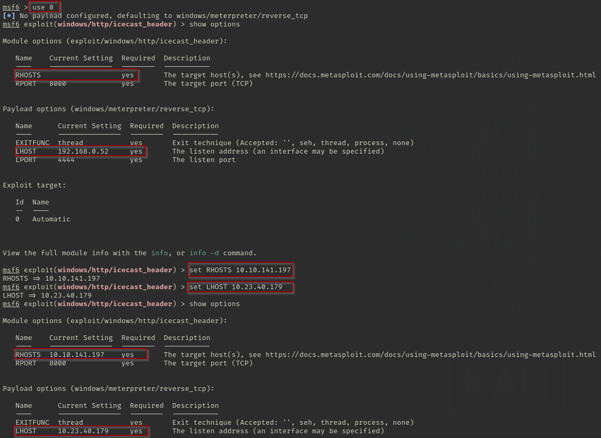

Para saber el información del sistema ponemos el siguiente comando:

```bash
sysinfo | findstr /B /C:"OS"
```


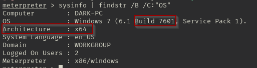

Ahora usamos el  `post/multi/recon/local_exploit_suggester` ejecutamos y seleccionamos la que pone `winwos/local/bypassuac_eventvwr` y la configuramos y ejecutamos.

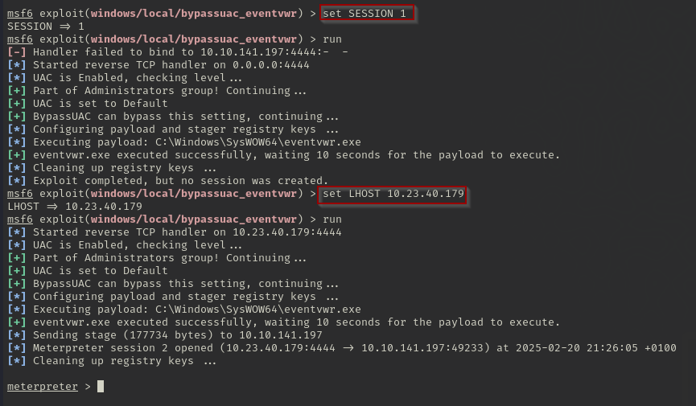
Una vez estemos en el meterpreter usamos el comando `getprivs` para ampliar los permisos.
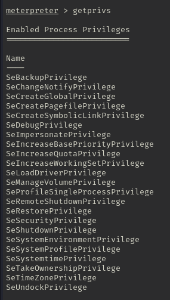


Ahora hacemos ps para ver la lista de procesos para ver si encontramos alguno sospechoso

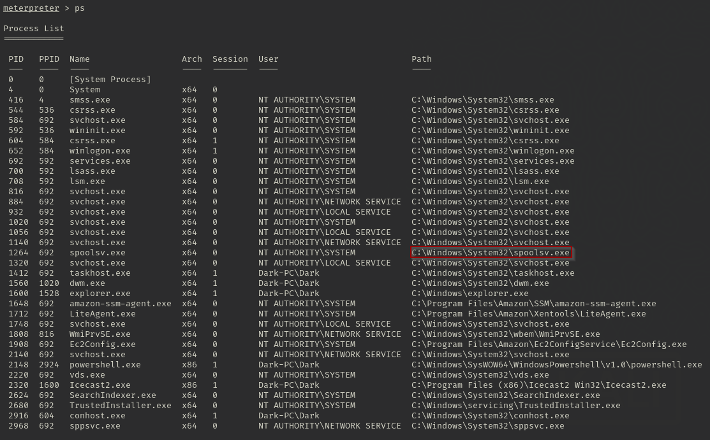


Ahora nos migramos de proceso con  el comando 
```bash
migrate -N nombreDelProceso
```


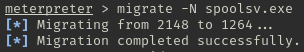

Despúes miramos que usuario esta listado con el siguiente comando

```bash
getuid
```

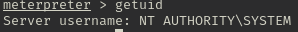


Ahora instalamos kiwi que es una Mejora de la version de Mimikatz


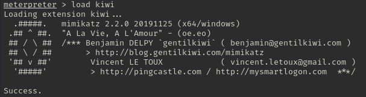


Y obtenemos todas las credenciales con el comando  `creds_all`


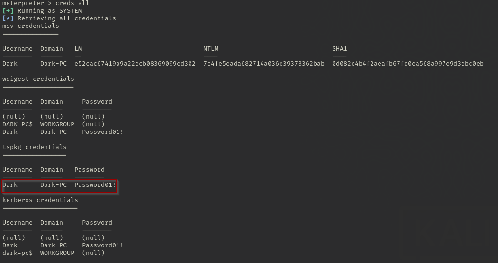


Y vemos que la contraseña del usuario `Dark` es `Password01!`


 Para dumpear todas las contraseñas utilizamos `hashdump`

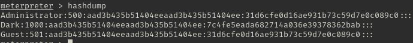


Para ver en remoto el escritorio del usuario en tiempo real usamos `screenshare`

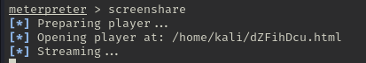

Para probar la grabacion de micro probamos `record_mic` y para modificar la MAC utilizamos `timestomp` y para mantener la persistencia y autenticación utilizamos `golden_ticket_create`.

