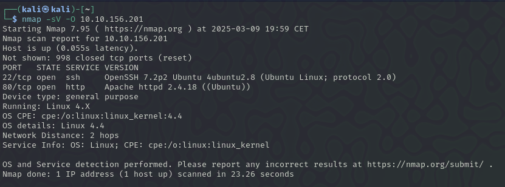
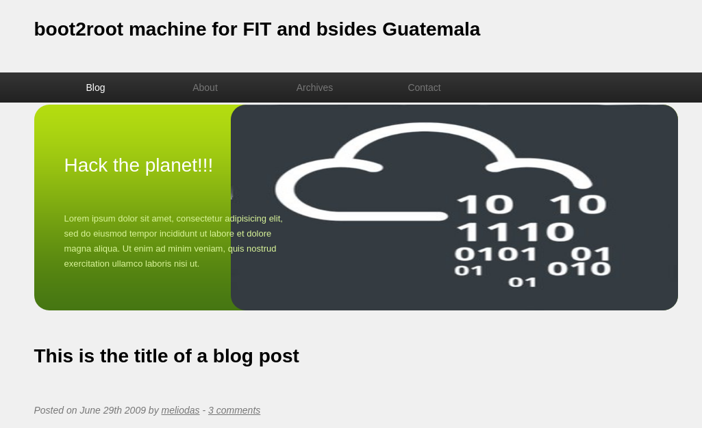
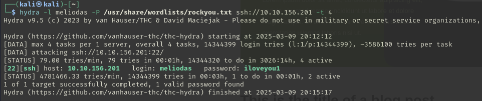
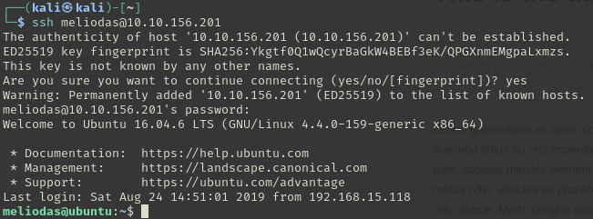
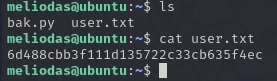

# Library

## Escaneo de puertos

```bash
nmap -sV -O ip
```



Vemos que tiene un servicio http y entramos en la pagina y encontramos lo siguiente



Vemos que hay un nombre de usuario que se llama `meliodas` y como tenemos un servicio `ssh` nos intentaremos conectar mediante `ssh` al usuario `meliodas` para ello le haremos fuerza bruta con hydra

## Hydra

Ahora le haremos fuerza bruta con hydra para ver si podemos conseguir la contraseña

```bash
hydra -l meliodas -P /usr/share/wordlists/rockyou.txt ssh://10.10.156.201 -t 4
```

-l: para especificar el nombre de un usuario
-P: para un diccionario de contraseña
-t: los hilos que quiere que se ejecuten a la vez

Una vez terminado el hydra hemos encontrado la contraseña que es `iloveyou1`



Ahora nos intentaremos conectar por ssh

## SSH

Efectivamente tenemos acceso a SSH de `meliodas`



Una vez dentro hacemos `ls` y nos encontramos dos archivos uno que se llama `bak.py` y otro que se llama `user.txt` y le hacemos `cat` al `user.txt` y encontramos la primera flag



## Escalada de privilegios

1. Eliminamos el archivo protegido (`bak.py`). `rm bak.py`
2. Creamos un nuevo `bak.py` con un intento fallido de ejecutar un comando en Python.

    ```bash
    echo "python -c 'import pty;pty.spawn("/bin/bash")'" > bak.py
    ```

3. Corregir el error escribiendo correctamente el código Python:

```python
`import pty; pty.spawn("/bin/bash")`    
```

Este comando invoca una shell interactiva (`/bin/bash`).
4.  Ejecutar el script con `sudo`, obteniendo una shell como root.


