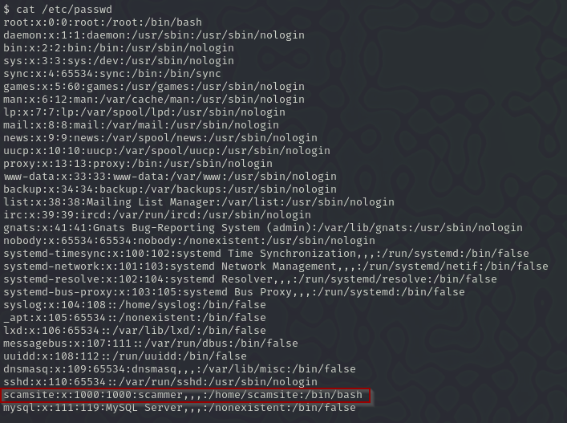
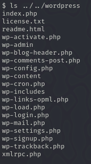
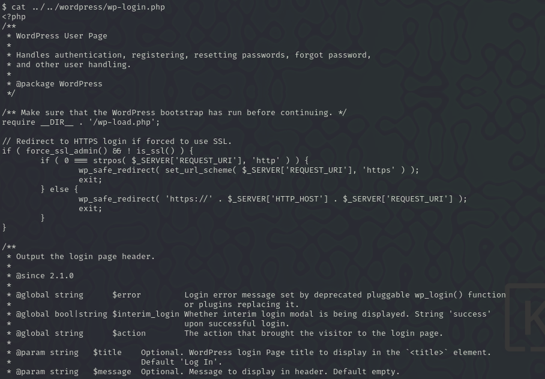

# TECH_SUPP0RT

## Escaneo de puertos

```bash
nmap -sV -O ip
```

-sV: para las versiones

-O: para el SO


## Entramos en el samba

```bash
smbclient -L //10.10.193.97/ -N
```


Probamos a entrar en algunos de los recursos y el único en el que hemos encontrado algo interesante es en `websvr`


Y nos traemos el archivo con el comando `get`


Entramos en el archivo y vemos el siguiente mensaje


Para descifrar la contraseña hemos utilizado `hashcat` pero no hemos encontrado la contraseña y entonces nos hemos metido en la web `cyber chef` y hemos utilizado la opción `magic` y nos ha dado que la contraseña es `Scam2021`


Ahora entramos en `/Subrion/panel` para iniciar sesión, en el login vemos que la versión es `Subrion CMS v4.2.1` y lo que vamos hacer es buscar vulnerabilidades para poder explotarlas  y ponemos las credenciales y nos conseguimos loguear:


Buscamos el exploit de Subrion CMS v4.2.1


Nos descargamos el .py con el siguiente comando `searchsploit -m php/webapps/49876.py` y ejecutamos el comando

```bash
sudo python 49876.py -u http://10.10.70.111/subrion/panel/ -l admin -p Scam2021
```


-u: para la url
-l: para el usuario
-p: para la contraseña

Una vez dentro miramos que somos en el sistema con whoami. Ahora lo que vamos a a hacer es buscar algun usuario y para ello nos vamos a `/etc/passwd` y nos hemos encontrado que hay un usuario que se llama `scamsite`



Ahora como tenemos un nuevo usuario vamos a intentar conectarnos por ssh al usuario `scamsite`

```bash
ssh scamsite@10.10.70.111
```


No lo hemos conseguido porque nos falta la contraseña entonces ejecutamos otra vez el python para entrar y ver si en algunas configuraciones encontramos algo. Buscando configuraciones hemos encontrado la configuración del worpress y vamos a buscar si en algunos de los archivos hay algo relacionado con la contraseña:



Hemos mirado en el `wp-login` pero no hay nada



Despues hemos mirado en `wp-config.php` y hemos encontrado la contraseña que es `ImAScammerLOL!123!`


Ahora nos volvemos a intentar a conectar por ssh con esta contraseña y ahora si entramos


sudo -l : Muestra los comandos que el usuario puede ejecutar con sudo.
file=/root/root.txt : Define una variable llamada `file` con la ruta del archivo.
sudo iconv -f 8859_1 -t 8859_1 "$file: Usa `iconv` con privilegios de sudo para convertir la codificación del archivo, aunque en este caso, la conversión es redundante (8859_1 a 8859_1)

Y nos da la flag `851b8233a8c09400ec30651bd1529bf1ed02790b`
